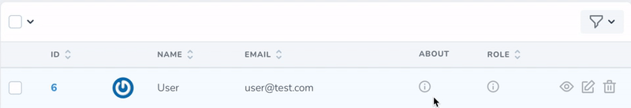

# A tooltip field for Nova apps

[](https://packagist.org/packages/elbytes/nova-tooltip-field)
[](https://packagist.org/packages/elbytes/nova-tooltip-field)

With this tooltip field, you can hide some optional content.  
On the index page, this field will work as a tooltip, on all other pages, it's just a text field.

<kbd>
    
</kbd>

## Installation

You can install the package in to a Laravel app that uses [Nova](https://nova.laravel.com) via composer:

```bash
composer require elbytes/nova-tooltip-field
```

## Usage

In your resource class, add the following to your fields method:

```php
use Elbytes\NovaTooltipField\Tooltip;

....

Tooltip::make('Type', 'type'), 

// OR

Tooltip::make('Type', 'type')
       ->setDefaultIcon('<svg width="18" height="18">...</svg>') // Optional
       ->setDependIcons([
           'fieldValue' => '<svg width="18" height="18">...</svg>',
           'fieldValue2' => '<svg width="18" height="18">...</svg>',
       ]), // Optional
```

### Using with your own icon

To change the default icon, you need to use the setDefaultIcon method.

```php
use Elbytes\NovaTooltipField\Tooltip;

....

Tooltip::make('Type', 'type')
    ->setDefaultIcon('<svg width="18" height="18">...</svg>')
```

### Value-dependent icons

Sometimes the icon has to change depending on the value of the field, you can use the setDependIcons method for this.

```php
use Elbytes\NovaTooltipField\Tooltip;

....

Tooltip::make('Type', 'type')
       ->setDependIcons([
           'fieldValue' => '<svg width="18" height="18">...</svg>',
           'fieldValue2' => '<svg width="18" height="18">...</svg>',
       ]),
```

## Contribution

All contributions, big or small, are welcome!

## License

The MIT License (MIT). Please see [License File](LICENSE) for more information.
